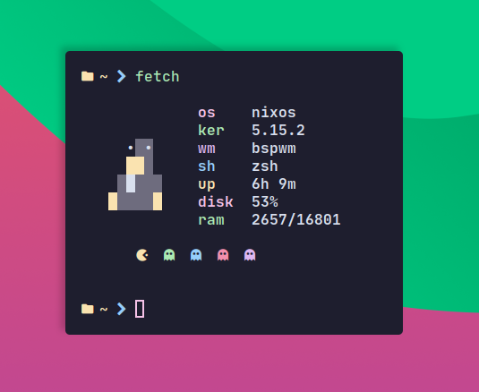

# Simple system fetch utility

# 💿 Installation 

## ❄️  NixOS

Add flake to your configuration or 
`nix run github:sioodmy/fetch --no-write-lock-file`

## 🐧 Other

Copy `fetch` script somewhere into your path

`cp fetch ~/.local/bin`

